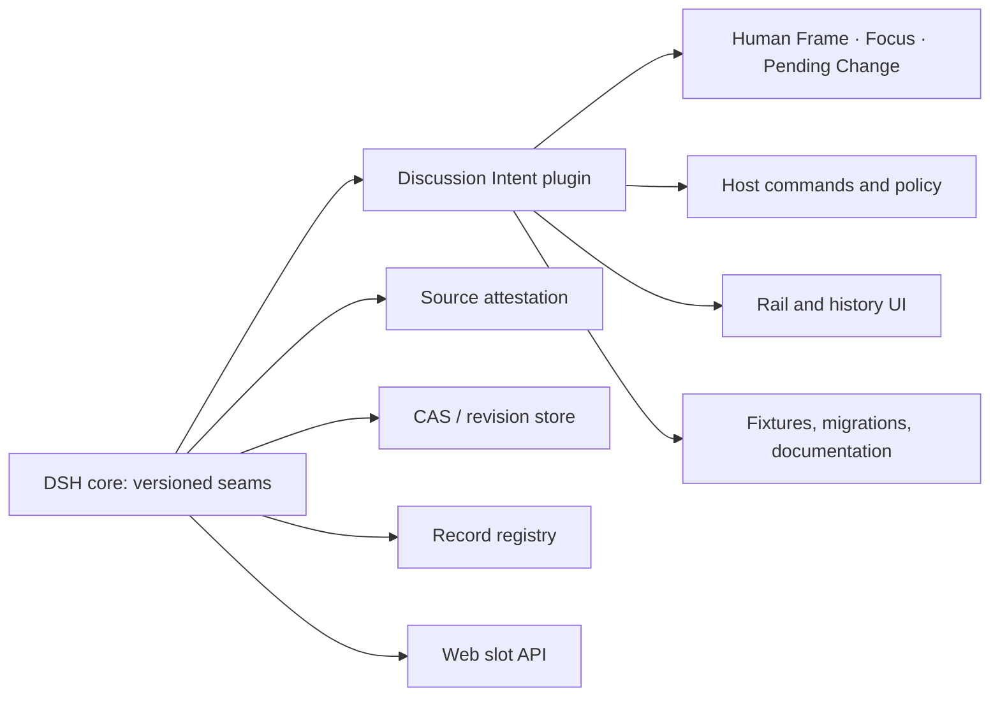

# DSH Discussion Intent

一个独立维护的 DeepSeek Harness（DSH）插件，用于把讨论中的用户意图、焦点和待确认的框架变更表示为可审计、可回放的会话语义。

> 当前状态：**插件基础仓库已建立，尚未发布。** 先稳定 DSH 的宿主接口，再交付可启用的运行时；不会把依赖 Harness 私有实现的代码伪装成可维护的插件。

English: see [Project status](#project-status) and [Architecture](#architecture).

## 为什么独立维护

Discussion Intent 曾作为 DSH 原生实现探索，涉及全局 Work Mode、会话 revision、用户消息来源证明、Record、Brief/Run 回流及 Web 界面。这些职责不应全部堆入主仓，也不应被一个第三方插件重新实现。

本仓库是产品逻辑的唯一来源；DSH 主仓只应提供版本化、通用的宿主 seam。这样可让插件按自己的发布节奏演进，同时不把存储、信任边界或全局模式复制到外部包。

## Project status

`0.1.0` is a source-available foundation, not an installable feature release. It contains:

- a portable, tested domain contract for Human Frames and reviewable frame changes;
- a DSH bundle layout with host, invariant, and client entry points;
- an explicit core-seam contract and migration plan;
- package, CI, and release guards for future npm distribution.

It intentionally does **not** register a global DSH mode, claim to verify user text, or persist data in a private store. Those are DSH core responsibilities and must be reached through versioned public APIs first.

## Architecture



### DSH core owns

- user-source attestation and its trust root;
- compare-and-swap revision storage;
- Record-type registration and serialization;
- Brief/Run lifecycle and provenance envelope;
- global Work Mode semantics;
- public host and browser-slot APIs.

### This plugin owns

- the semantics of Human Frame, Focus, Working Item and Pending Frame Change;
- discussion-specific command policy and prompt templates;
- plugin-namespaced Record serializers and migrations;
- the Discussion Rail and history/trajectory renderers;
- compatibility tests, user documentation and releases.

## Planned runtime surface

The first runtime release is deliberately mode-free. A user enables the capability for a profile or session; it does not create or override DSH's global `discussion` mode.

| Surface | Planned v0.1 behavior |
| --- | --- |
| Host | Create a verified Human Frame, propose a pending frame change, then accept or reject it with audit evidence. |
| Records | Register namespaced record kinds such as `urn:dsh-plugin:discussion-intent:human-frame:v1`. |
| Brief/Run | Consume the core provenance envelope as a contributor; never own the lifecycle. |
| Client | Read-only four-row rail and discussion-history nodes; browser writes are deferred until the host command contract is stable. |
| Work Mode | No global mode registration or override. |

See [the extraction contract](docs/EXTRACTION.md) and [the roadmap](docs/ROADMAP.md).

## Installation

There is no published runtime release yet. Once `0.1.0` is released, the supported path will be:

```sh
dsh plugin --profile web add @jinplu/dsh-plugin-discussion-intent
```

GitHub source installs will be documented only after the package has a self-contained `prepare` build and a pinned compatibility matrix. npm packages will include built artifacts.

## Development

Requires Node.js 22+ and pnpm 10+.

```sh
pnpm install
pnpm typecheck
pnpm test
pnpm build
pnpm pack --pack-destination .artifacts
```

The current test suite covers the transport-independent domain contract. Host, browser and real-DSH integration suites will join the repository once the required public seams are available.

## Compatibility policy

Before publishing a runtime release, this repository will declare:

- a minimum supported DSH version and explicit peer-dependency range;
- capability negotiation for `cas.v1`, `records.v1`, source attestation, Brief/Run provenance and `ui.slots.v1`;
- CI coverage for the oldest supported DSH version, latest release and a canary build;
- a `0.x` breaking-change policy and explicit record migrations.

No version will silently fall back to unverified user quotes or private DSH source imports.

## Contributing

Read [CONTRIBUTING.md](CONTRIBUTING.md). Please report security-sensitive source-attestation or data-isolation issues privately as described in [SECURITY.md](SECURITY.md).
