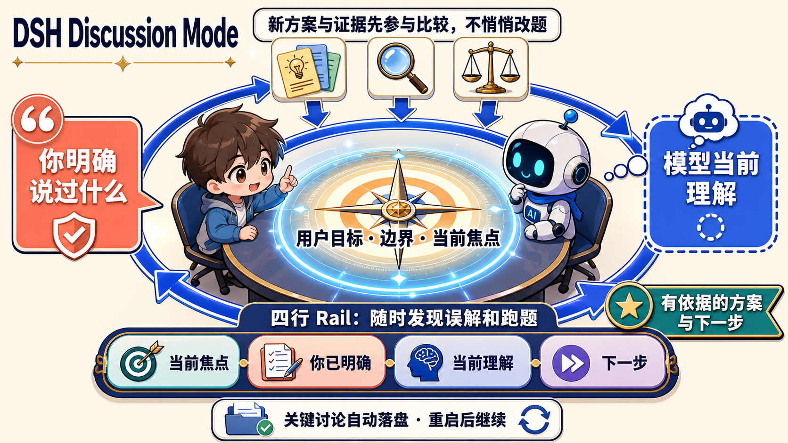

# DSH Discussion Mode

> **为复杂思考设计的 DSH 讨论模式：保持用户意图、控制讨论焦点，把探索收敛成有依据的下一步。**

<p align="center">
  <a href="#core">核心卖点</a> ·
  <a href="#quick-start">快速开始</a> ·
  <a href="#rail">四行 Rail</a> ·
  <a href="#continuity">讨论可续</a> ·
  <a href="#boundaries">设计边界</a>
</p>

<p align="center">
  
</p>

<p align="center"><sub>概念导图：图中文字对应实际产品能力，不代表 DSH 界面截图。</sub></p>

当目标还没完全想清、方案与新证据不断涌入时，AI 很容易把最新的局部信息或自己的理解悄悄变成主线。Discussion Mode 是 DSH 的意图校准型讨论模式：你负责目标、边界、评价标准与最终选择；模型负责提出暂定理解、拆解、比较、挑战和收敛。

输入 `/discussion` 只设定讨论深度，不会替你装主题。下一句用户消息才开始讨论。插件持续区分“你明确说过什么”和“模型当前怎样理解”，让新方案与证据先作为候选参与比较；要改标题、目标或根焦点，必须经过待确认变更，由你 `/discussion accept` 或 `/discussion reject`。最终得到的不是一串越聊越散的消息，而是一条可执行、可验证、可持续推进的决策路径。

<a id="core"></a>

## ✨ 核心卖点

- **意图不漂移（宿主强制）**：用户明确的目标、边界、评价标准和否定项作为 Human Frame 持续注入；`discussion_update` 不能静默改写标题、目标、根焦点、已有 Human Frame 或已记录的否定。新论文和工具结果只能留在候选里。理解可以直接写；建议、下一步和把选项升格为 favored 不得与仍有效的否定或非目标矛盾。
- **从模糊想法到可执行判断**：不要求预先填写主题或表单。`/discussion 1|2|3` 只设深度。模型可以提出暂定理解和方案比较，也可以提出改题，但改题必须等你接受。
- **实时看见、随时纠偏**：空闲时是 `当前焦点 / 你明确说过 / 当前理解 / 下一步` 四行 Rail；有待确认变更时多一行 Pending，可直接 `/discussion accept <id>` 或 `/discussion reject <id>`，无须翻日志。
- **讨论可续、过程可信**：关键讨论自动沉淀到当前工作区；暂停或重启后可恢复同一场讨论，包括未处理的 Pending Frame Changes。保存失败会明确提示。

它特别适合研究方向、产品策略、技术路线、实验设计、创新判断和跨方案取舍等没有标准答案的复杂问题。

## 🧭 为什么不是普通聊天或长记忆

| 普通 AI 对话 | Discussion Mode |
| --- | --- |
| 模型可能按最近的信息重述问题 | 用户明确的目标、边界、否定项与评价标准持续作为讨论依据 |
| 模型总结容易看起来像用户已作出的决定 | 明确分开呈现“你已明确”与“当前理解” |
| 新论文、局部机制或子问题可能直接成为叙事中心 | 新信息先作为候选、证据或反证；升格为根问题必须 `/discussion accept`；建议、下一步和选项升格不得与已记录否定矛盾 |
| 深入局部后容易忘记原本要解决什么 | 保持当前焦点、问题层级与需要返回的上位问题 |
| 讨论结束时可能只有观点，没有决策路径 | 收敛为建议、风险、待验证点与下一步行动 |

换句话说：它不是替模型增加一段“长记忆”，也不是一次性的需求问答；它是服务于**单场复杂讨论**的控制层，让模型始终知道：**谁定义问题、什么不能被改写、当前在回答哪一层问题，以及什么证据才足以改变方向。**

Discussion Mode 是**插件内部的服务与状态**（档位 `1=fast | 2=default | 3=deep`，由本插件定义与解析），不是 DSH 的全局模式枚举；插件不修改 DSH 主仓，也不向会话日志写入任何自定义事件。

<a id="quick-start"></a>

## 🚀 快速开始

```sh
dsh plugin --profile web add @jinplu/dsh-plugin-discussion-intent
```

启动 DSH 后输入：

```text
/discussion              start or resume, default intensity, no topic
/discussion 1|2|3        set depth only
/discussion accept <id>  accept a pending topic/frame change
/discussion reject <id>  reject it
/discussion off          pause; state kept
```

- `/discussion`：开始或恢复 Discussion Mode；新讨论默认 `2=default` 且无标题，恢复已有讨论时保留上次档位和已锁定内容。
- `/discussion 1`：快速讨论——只改深度，不装主题。
- `/discussion 2`：标准讨论——只改深度，不装主题。
- `/discussion 3`：深度讨论——只改深度，不装主题；下一句用户消息才开始讨论。
- `/discussion accept <id>` / `/discussion reject <id>`：处理一条 Pending Frame Change。
- `/discussion off`：暂时退出；讨论状态与落盘记录保留，之后可继续。

不要在命令后写 topic。`3` 是深度，不是主题。如果真正缺少的是你的偏好、边界或方向选择，模型用 DSH 原生 `ask_user_question` 一次问清，能检索或推理的事实不反问用户。

<a id="rail"></a>

## 🗺️ 讨论状态与四行 Rail

插件维护一份紧凑的、随讨论推进的私有状态：

- 未命名的初始标题与“尚无主题”，以及你接受后才生效的标题/目标/根焦点；捕获 decision 或 goal 原话时，空的 Focus（以及空的 Goal）由该原话安装，不是模型暂定标题；
- 用户明确说过的约束和偏好（保留原话与来源，模型重述与原话严格分离）；You 行露出全部仍有效的否定与决定；
- 当前焦点问题、所在层级、完成后要回到哪里；
- 待确认的框架变更（Pending Frame Changes）；
- 已比较的方案、证据、被否定方向（研究证据保持为候选）；
- 当前理解、建议、下一步和简短历史摘要。

Web profile 会在输入框上方显示只读 Rail（空闲时四行 `Focus / You / Understanding / Next`，中文界面显示 `当前焦点 / 你明确说过 / 当前理解 / 下一步`）。存在待确认变更时多一行 Pending，方便直接 accept/reject。空闲时不会显示假主题。Rail 通过插件注册的 HTTP/SSE 通道实时刷新；`/discussion off` 后 Rail 立即消失，重新开始或恢复讨论时重新出现。

<a id="continuity"></a>

## 💾 讨论可续、过程可信

每次实质性更新都会在继续回复**之前**写入当前工作区：

```text
.dsh/discussions/<session-id>.json   权威状态（插件私有侧车文件）
.dsh/discussions/<session-id>.md     人类可读的讨论检查点
```

关键讨论先沉淀为人类可读的 Markdown 检查点，再同步权威 JSON 状态。`pendingFrameChanges` 写在同一份 version `1` 侧车上；旧文件缺省该字段时按 `[]` 解码。写入失败会明确报告保存错误，不会把“尚未保存”伪装成“已经记住”。DSH 完全退出、重启并重新打开同一会话后，讨论会从侧车恢复，`/discussion`、`discussion_update` 工具、系统提示策略与 Web Rail 都能看到同一份状态。插件不会写入自定义 DSH 会话事件或改变日志格式；`/discussion 1|2|3` 不再写入一条“请推断主题”的 notice。

<a id="boundaries"></a>

## 🛡️ 设计边界

```text
/discussion 1|2|3
  → 只设深度，未命名检查点，不推断主题
  → 用户下一句开始讨论
  → 每次实质回复前更新讨论状态（先写 Markdown，再写 JSON）
  → 标题/目标/根焦点改写变成 Pending Frame Changes
  → /discussion accept <id> 或 /discussion reject <id>
  → 系统提示策略重注 Human Frame + Web Rail
  → 完全退出 DSH 后从侧车恢复
  → 继续讨论或 /discussion off
```

插件只依赖已发布的 DSH `0.1.0-rc.6` 公共接口：`commands`、`sessions`、`systemPrompt`、`tools`、`invariants`，以及 web profile 中可选的 `webServer`（用于 Rail 通道）。没有 `webServer` 的 headless/TUI profile 下功能完整、只是没有 Rail。

**rc.6 研究冻结限制（如实）**：官方 rc.6 没有原生 `contributeRun`。本插件不能像原生 Discussion Mode 那样冻结一次宿主 Research Run；它只能拒绝让这些结果改写已锁定的问题。研究/选项证据保持为候选，升格为根问题必须经过 Pending Frame Change。

实现细节见 [Runtime integration](docs/EXTRACTION.md)，交付状态见 [Roadmap](docs/ROADMAP.md)。

## 🧪 本地开发

需要 Node.js 22+ 和 package.json 指定的 pnpm 版本。

```sh
pnpm install
pnpm typecheck
pnpm test
pnpm build
pnpm pack:check
pnpm test:consumer
```

`test:consumer` 把真实 tarball 安装进全新临时 DSH profile（默认使用 `pnpm dlx @deepseek-ai/dsh@0.1.0-rc.6`，可用 `DSH_SMOKE_DSH_REPO`/`DSH_SMOKE_DSH_VERSION` 覆盖），验收：配置 dump、实际启动、`/discussion` 命令、`discussion_update` 工具、Markdown/JSON 落盘、客户端 Rail bundle 与页面注入、HTTP 状态快照与 SSE 推送、完整停止 → 二次启动 → 恢复同一会话并继续更新。

## Contributing

参阅 [CONTRIBUTING.md](CONTRIBUTING.md)。安全问题请按 [SECURITY.md](SECURITY.md) 说明报告。
